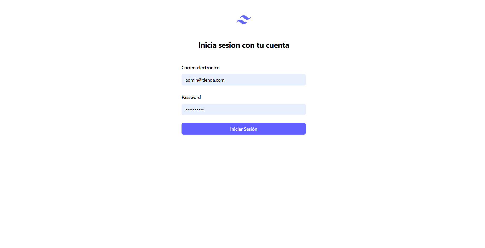
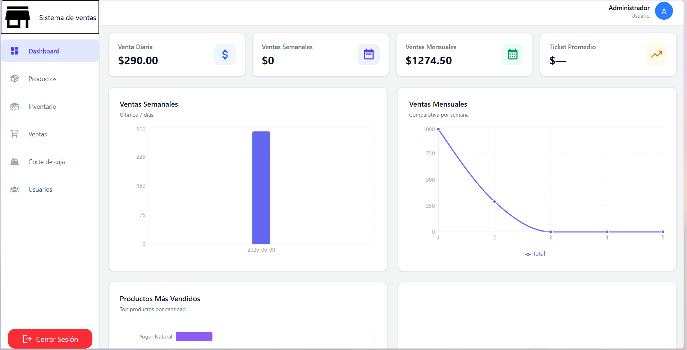
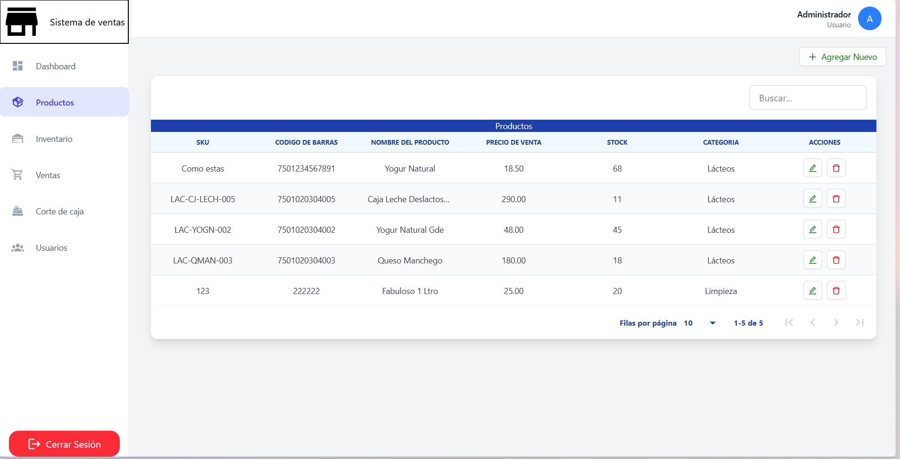
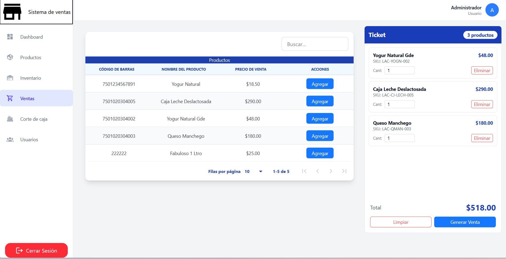

# POS Frontend — Sistema de Punto de Venta

> **Estado:** En desarrollo activo ⚠️  
> Aplicación web para gestión de ventas, productos y reportes de un punto de venta.

---

## Stack Tecnológico

| Categoría | Tecnología |
|-----------|-----------|
| Framework | React 19 + Vite |
| Lenguaje | JavaScript (JSX) |
| Estilos | Tailwind CSS v4 |
| Componentes UI | Ant Design, React Aria Components |
| Tablas | react-data-table-component |
| Gráficas | Recharts |
| Iconos | Material Design Icons (@mdi/react) |
| Enrutamiento | React Router DOM v7 |
| Peticiones HTTP | Axios |
| Backend | Laravel (API REST) |

---

## Pantallas del Sistema

### 1. Inicio de Sesión (`/login`)



Formulario de autenticación con correo electrónico y contraseña.  
Consume `POST /api/login` del backend Laravel y almacena el token JWT en `localStorage`.

---

### 2. Dashboard (`/home`)



Panel principal con tarjetas de métricas clave:

- **Venta Diaria** — Monto acumulado del día.
- **Ventas Semanales** — Total de la semana en curso.
- **Ventas Mensuales** — Acumulado del mes.
- **Ticket Promedio** — Gasto promedio por compra.

Cada KPI incluye un icono distintivo y fondo de color para identificar visualmente la métrica.
Dos gráficas principales:

- **Ventas Semanales** — Gráfica de barras con los montos por día (últimos 7 días).
- **Ventas Mensuales** — Línea comparativa por semana del mes actual, con tooltips interactivos.

Sección inferior del dashboard:

- **Productos Más Vendidos** — Barras horizontales con el top de productos por cantidad vendida.
- **Ventas por Método de Pago** — Sección en desarrollo.

Endpoints: `GET /api/dashboard` y `GET /api/dashboard/ventas-mensual-semanas`.

---

### 3. Productos (`/products`)



Catálogo de productos con tabla interactiva que incluye:

- SKU, código de barras, nombre, precio de venta, stock y categoría.
- Barra de búsqueda para filtrar en tiempo real.
- Acciones por fila: editar y eliminar producto.
- Botón flotante para agregar nuevo producto.
- Paginación incluida.

Endpoints: CRUD completo contra `GET /api/productos`.

---

### 4. Ventas (`/sales`)



Módulo de generación de ventas con:

- **Panel de Productos** — Tabla con todos los productos disponibles y botón "Agregar".
- **Panel de Ticket** — Lateral con resumen de productos agregados, cantidades editables y total.
- **Generación de Venta** — Modal para ingresar el monto recibido y confirmar la compra.
- Contador de productos en el header del ticket.
- Estado vacío con icono cuando no hay productos seleccionados.

Endpoint: `POST /api/ventas` para registrar la venta con sus items.

---

### 5. Inventario (`/inventory`)

En desarrollo — ruta definida en el sidebar pero sin implementar.

---

### 6. Corte de Caja (`/cash-cut`)

En desarrollo — ruta definida en el sidebar pero sin implementar.

---

### 7. Usuarios (`/users`)

En desarrollo — ruta definida en el sidebar pero sin implementar.

---

## Estructura del Proyecto

```
src/
├── api/                # Clientes Axios para cada recurso
│   ├── axios.js        # Configuración base + interceptores
│   ├── authApi.js      # Login, logout
│   ├── dashboardApi.js # Datos del dashboard
│   ├── productosApi.js # CRUD productos
│   └── ventasApi.js    # Generación de ventas
├── components/         # Componentes reutilizables
│   ├── GlobalComponents/
│   │   └── DataTablePrime.jsx
│   ├── Products/
│   │   ├── AddProduct.jsx
│   │   └── DeleteProduct.jsx
│   ├── VentasComponents/
│   │   └── addProductTicket.jsx
│   ├── cardLoader.jsx
│   ├── LoadingOverlay.jsx
│   ├── LogoutButton.jsx
│   ├── Navbar.jsx
│   └── SideBar.jsx
├── context/            # Contextos de React
│   ├── AuthContext.jsx
│   ├── LoadingContext.jsx
│   └── SidebarContext.jsx
├── layouts/
│   └── MainLayout.jsx  # Layout con sidebar + navbar
├── pages/
│   ├── Dashboard.jsx
│   ├── Index.jsx
│   ├── login.jsx
│   ├── Products.jsx
│   └── Venta.jsx
├── styles/
│   ├── globals.css
│   ├── theme.css       # Variables de diseño Tailwind v4
│   └── typography.css
├── App.jsx             # Router principal
└── main.jsx            # Entry point
```

---

## Instalación y Ejecución

```bash
# 1. Clonar el repositorio
git clone <repo-url>
cd pos-frontend

# 2. Instalar dependencias
npm install

# 3. Configurar API (src/api/axios.js)
#    Cambiar baseURL a la URL del backend Laravel

# 4. Iniciar servidor de desarrollo
npm run dev

# 5. Compilar para producción
npm run build
```

---

## Funcionalidades Pendientes

- [ ] Módulo de Inventario
- [ ] Corte de Caja (cierre de turno)
- [ ] Administración de Usuarios
- [ ] Reportes avanzados
- [ ] Modo oscuro
- [ ] Exportación de datos (PDF/Excel)
- [ ] Notificaciones en tiempo real

---

## Licencia

Proyecto privado — uso interno.
